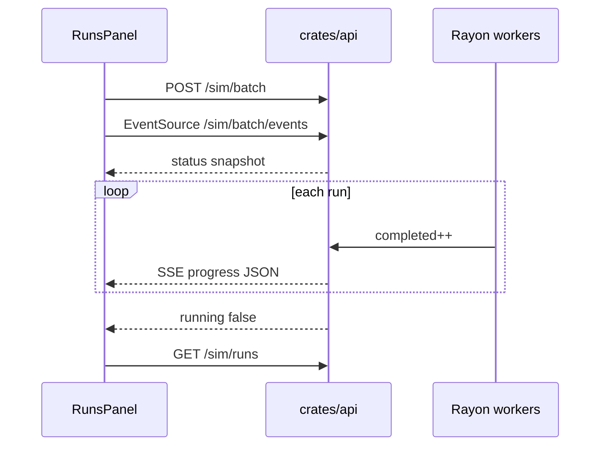

# API (`crates/api`)

Axum + Tokio. Binds `0.0.0.0:3000` with permissive CORS (dev). Batch-only — the old live `/sim/start` + WebSocket path was removed.

## Modules

| Module | Role |
|---|---|
| [`main.rs`](../crates/api/src/main.rs) | Router |
| [`routes.rs`](../crates/api/src/routes.rs) | Handlers, `AppState`, SSE |
| [`runner.rs`](../crates/api/src/runner.rs) | `spawn_batch` (Rayon), IWRAP stamp, status publish |
| [`stats.rs`](../crates/api/src/stats.rs) | Mann–Whitney U + Holm–Bonferroni + Cliff’s δ |
| [`db.rs`](../crates/api/src/db.rs) | SQLite store, deep-merge, parquet export |

## Endpoints

| Method + path | Purpose |
|---|---|
| `GET /health` | Liveness |
| `POST /sim/batch` | Launch factorial / sweep (`n_seeds`, `n_ticks`, `scenarios[]`, `methods[]`, `config_override`) |
| `GET /sim/batch/status` | Progress snapshot |
| `GET /sim/batch/events` | **SSE** stream of the same progress JSON (pushed each completed run) |
| `GET /sim/batch/results` | Per-run KPI rows |
| `GET /sim/batch/stats` · `/sim/batch/hypothesis` | Hypothesis battery |
| `GET /sim/batch/export.parquet?all=` | Parquet (this batch or whole DB) |
| `GET /sim/ais-paths` | Route network for the map |
| `GET /sim/runs` | Completed runs (manifests, newest first) |
| `GET /sim/runs/{id}/log` · `/manifest` | Playback JSONL / manifest |

## Progress events

Working directory must be the **repo root** so `data/` and `outputs/` resolve correctly.
