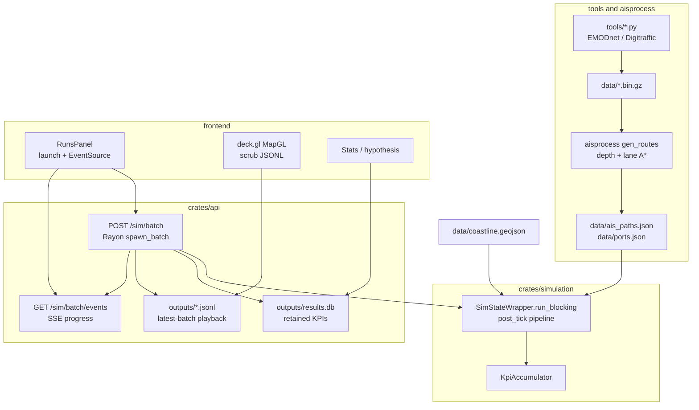
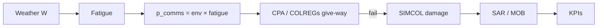

# Architecture

Batch-only execution: tools produce committed `data/`, the Rust engine runs factorial batches via the Axum API, and the React workbench plays back JSONL tick logs.

## Storage tiers

| Tier | Artifacts | Lifetime |
|---|---|---|
| Playback | `outputs/<run>.jsonl`, `*_manifest.json` | **Latest batch only** (cleared on next batch) |
| Results | `outputs/results.db`, parquet export | **Retained** across batches for sweeps |

`config_override` deep-merges onto scenario defaults; scenario / method / seed are always re-pinned.

## Tick causality (summary)

Full ordered list: [simulation.md — tick pipeline](simulation.md#tick-pipeline).
