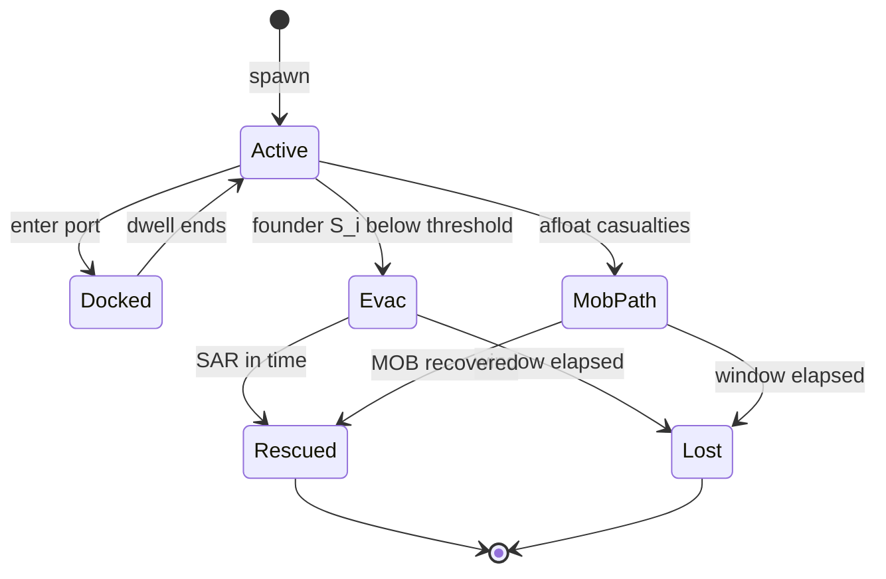

# Simulation engine (`crates/simulation`)

`src/lib.rs` re-exports modules. Orchestration and the tick body live in [`state.rs`](../crates/simulation/src/state.rs).

## Modules

| Module | Responsibility |
|---|---|
| [`state.rs`](../crates/simulation/src/state.rs) | `SimState` / `SimStateWrapper`, `post_tick`, CPA avoidance, SAR/MOB, snapshots, JSONL |
| [`scenario.rs`](../crates/simulation/src/scenario.rs) | `Scenario`, `Method`, `SimConfig` factory |
| [`vessel.rs`](../crates/simulation/src/vessel.rs) | Vessel FSM, navigation, fatigue |
| [`weather.rs`](../crates/simulation/src/weather.rs) | 50×50 hazard field `W ∈ [0,1]` |
| [`comms.rs`](../crates/simulation/src/comms.rs) | Avoidance message kinds + rolling log |
| [`simcol.rs`](../crates/simulation/src/simcol.rs) | DTU SIMCOL consequence; SOLAS-shaped `S_i` (**ACCEPTED-SURROGATE**) |
| [`sar.rs`](../crates/simulation/src/sar.rs) | Liferaft SAR + MOB (Koopman / MASSIM) |
| [`ashrafi.rs`](../crates/simulation/src/ashrafi.rs) | Seasonal SAR degradation |
| [`iwrap.rs`](../crates/simulation/src/iwrap.rs) | IWRAP Mk II; `estimate_nc_from_ais_path` stamps batch rows |
| [`forcefield.rs`](../crates/simulation/src/forcefield.rs) | Optional Xiao 2013 steering (default off) |
| [`land.rs`](../crates/simulation/src/land.rs) | Coastline R-tree grounding |
| [`kpi.rs`](../crates/simulation/src/kpi.rs) | Six hypothesis KPIs + diagnostics |
| [`ais.rs`](../crates/simulation/src/ais.rs) | Route/port load + lat/lon ↔ field |
| [`bin/iwrap.rs`](../crates/simulation/src/bin/iwrap.rs) | CLI collision-frequency report |

## Vessel state machine

A **fatality is emergent**: unrecovered liferaft occupant or person-in-water when the survival window closes. Terminal vessels are reaped; fleet size is topped up.

## KPIs (`KpiSnapshot`)

| Field | Meaning | Hypothesis |
|---|---|---|
| `fatal_per_1k_hrs` | Fatalities / 1000 ship-hours | H1, H3 |
| `collision_per_1k_hrs` | Hard collisions / 1000 ship-hours | Calibration |
| `survival_ratio` | Crew surviving exposure | H2 |
| `avg_tta_hours` | Mean rescue time-to-arrival | H2 |
| `evac_activation_rate` | Fraction of runs with evac | H1 |
| `mean_p_prep` | Mean preparedness | H1 |

Ship-hours: $1/12$ h per **Active** vessel per tick ($\Delta t=5$\,min). Batch rows also carry `iwrap_nc_per_year` (offline IWRAP stamp).

## Tick pipeline

All physics runs in **`SimState::post_tick`** (shared by every batch worker):

1. Weather advances  
2. Grounding revert  
3. Hazard speed + fatigue (not Baseline A speed cut)  
4. Storm dampening  
5. ResumeRoute log  
6. Force field **or** CPA/COLREGs avoidance (comms-gated)  
7. Avoidance cooldown  
8. Same-destination following  
9. Rising-edge hard collision → SIMCOL → Evac / MOB  
10. `run_sar`  
11. `run_mob_sar`  
12. Reap terminals + fleet top-up  
13. KPI accumulate  
14. Snapshot → JSONL  

**Determinism:** one seeded `SmallRng` per `SimState`. Same seed ⇒ byte-identical KPIs.

## Tests

- [`tests/full_run.rs`](../crates/simulation/tests/full_run.rs) — smoke, determinism, seed variation  
- [`tests/calibration.rs`](../crates/simulation/tests/calibration.rs) — CalmPassage / Baseline A collision guard (`#[ignore]` for full length)  
- Module unit tests in `simcol`, `sar`, `iwrap`, `forcefield`, `ashrafi`, …
